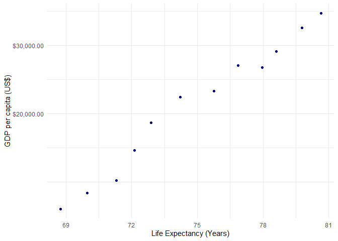
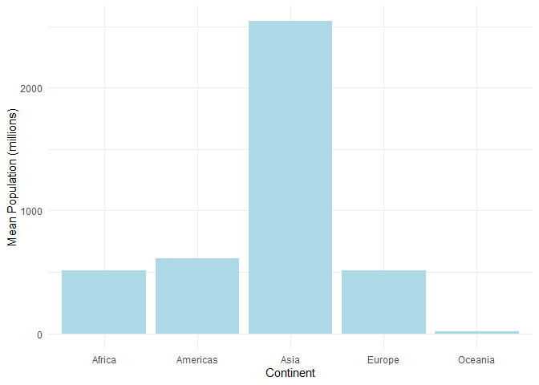
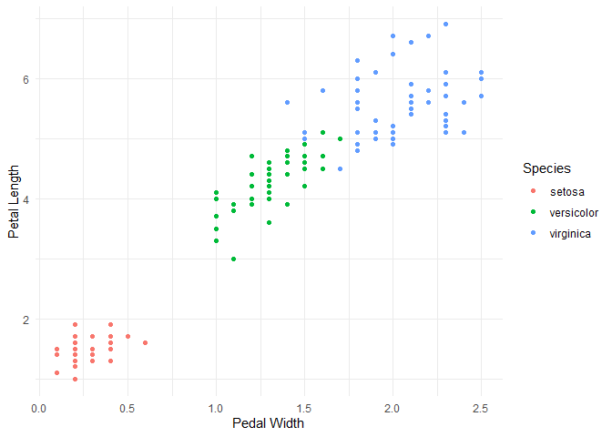
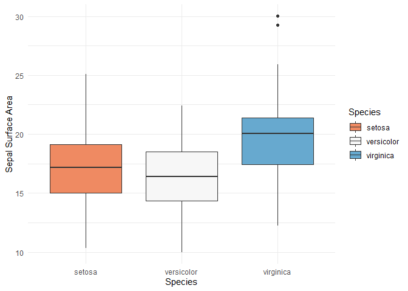

---
title: "Gapminder_pt_2"
output: 
  html_document:
    keep_md: true 
    theme: cerulean
    toc: true
---

# STAT545 Assignment 2: Gapminder Further Exploration


##Exercise 1: Basic dplyr

### 1.1 - Select Countries in 1970s

#### Canada, France, and New Zealand


```r
selectgapminder <- gapminder %>%
 filter(year >= 1970 & year <= 1979, 
   country == "Canada" | country == "France" | country == "New Zealand")
kable(selectgapminder)
```

<table>
 <thead>
  <tr>
   <th style="text-align:left;"> country </th>
   <th style="text-align:left;"> continent </th>
   <th style="text-align:right;"> year </th>
   <th style="text-align:right;"> lifeExp </th>
   <th style="text-align:right;"> pop </th>
   <th style="text-align:right;"> gdpPercap </th>
  </tr>
 </thead>
<tbody>
  <tr>
   <td style="text-align:left;"> Canada </td>
   <td style="text-align:left;"> Americas </td>
   <td style="text-align:right;"> 1972 </td>
   <td style="text-align:right;"> 72.88 </td>
   <td style="text-align:right;"> 22284500 </td>
   <td style="text-align:right;"> 18970.57 </td>
  </tr>
  <tr>
   <td style="text-align:left;"> Canada </td>
   <td style="text-align:left;"> Americas </td>
   <td style="text-align:right;"> 1977 </td>
   <td style="text-align:right;"> 74.21 </td>
   <td style="text-align:right;"> 23796400 </td>
   <td style="text-align:right;"> 22090.88 </td>
  </tr>
  <tr>
   <td style="text-align:left;"> France </td>
   <td style="text-align:left;"> Europe </td>
   <td style="text-align:right;"> 1972 </td>
   <td style="text-align:right;"> 72.38 </td>
   <td style="text-align:right;"> 51732000 </td>
   <td style="text-align:right;"> 16107.19 </td>
  </tr>
  <tr>
   <td style="text-align:left;"> France </td>
   <td style="text-align:left;"> Europe </td>
   <td style="text-align:right;"> 1977 </td>
   <td style="text-align:right;"> 73.83 </td>
   <td style="text-align:right;"> 53165019 </td>
   <td style="text-align:right;"> 18292.64 </td>
  </tr>
  <tr>
   <td style="text-align:left;"> New Zealand </td>
   <td style="text-align:left;"> Oceania </td>
   <td style="text-align:right;"> 1972 </td>
   <td style="text-align:right;"> 71.89 </td>
   <td style="text-align:right;"> 2929100 </td>
   <td style="text-align:right;"> 16046.04 </td>
  </tr>
  <tr>
   <td style="text-align:left;"> New Zealand </td>
   <td style="text-align:left;"> Oceania </td>
   <td style="text-align:right;"> 1977 </td>
   <td style="text-align:right;"> 72.22 </td>
   <td style="text-align:right;"> 3164900 </td>
   <td style="text-align:right;"> 16233.72 </td>
  </tr>
</tbody>
</table>

### 1.2 - Select Countries and GDP Per Capita


```r
selectgapminder <- gapminder %>%
  filter(year >= 1970 & year <= 1979, 
  country == "Canada" | country == "France" | country == "New Zealand") %>%
  select (country, gdpPercap)
kable(selectgapminder)
```

<table>
 <thead>
  <tr>
   <th style="text-align:left;"> country </th>
   <th style="text-align:right;"> gdpPercap </th>
  </tr>
 </thead>
<tbody>
  <tr>
   <td style="text-align:left;"> Canada </td>
   <td style="text-align:right;"> 18970.57 </td>
  </tr>
  <tr>
   <td style="text-align:left;"> Canada </td>
   <td style="text-align:right;"> 22090.88 </td>
  </tr>
  <tr>
   <td style="text-align:left;"> France </td>
   <td style="text-align:right;"> 16107.19 </td>
  </tr>
  <tr>
   <td style="text-align:left;"> France </td>
   <td style="text-align:right;"> 18292.64 </td>
  </tr>
  <tr>
   <td style="text-align:left;"> New Zealand </td>
   <td style="text-align:right;"> 16046.04 </td>
  </tr>
  <tr>
   <td style="text-align:left;"> New Zealand </td>
   <td style="text-align:right;"> 16233.72 </td>
  </tr>
</tbody>
</table>

### 1.3 - Changes in Life Expectancy


```r
selectgapminder <- gapminder %>%
  group_by(country)%>%
  arrange(year)%>%
  mutate(IncreaseInLifeExp = difference(lifeExp)) %>%
  arrange(IncreaseInLifeExp) %>%
  filter(IncreaseInLifeExp < 0)
datatable(selectgapminder)
```

<!--html_preserve--><div id="htmlwidget-5742729b4594bc405bb8" style="width:100%;height:auto;" class="datatables html-widget"></div>
<script type="application/json" data-for="htmlwidget-5742729b4594bc405bb8">{"x":{"filter":"none","data":[["1","2","3","4","5","6","7","8","9","10","11","12","13","14","15","16","17","18","19","20","21","22","23","24","25","26","27","28","29","30","31","32","33","34","35","36","37","38","39","40","41","42","43","44","45","46","47","48","49","50","51","52","53","54","55","56","57","58","59","60","61","62","63","64","65","66","67","68","69","70","71","72","73","74","75","76","77","78","79","80","81","82","83","84","85","86","87","88","89","90","91","92","93","94","95","96","97","98","99","100","101","102"],["Rwanda","Zimbabwe","Lesotho","Swaziland","Botswana","Cambodia","Namibia","South Africa","Zimbabwe","China","Botswana","Zambia","Iraq","Liberia","Cambodia","Kenya","Somalia","Zambia","Swaziland","Uganda","Swaziland","Lesotho","Cote d'Ivoire","South Africa","Gabon","Burundi","Congo, Rep.","Kenya","Central African Republic","Namibia","Congo, Dem. Rep.","Central African Republic","Uganda","Cote d'Ivoire","Malawi","Cameroon","Mozambique","Korea, Dem. Rep.","Rwanda","Cameroon","Lesotho","Zimbabwe","Tanzania","Mozambique","Malawi","Congo, Dem. Rep.","Iraq","Sierra Leone","South Africa","El Salvador","Montenegro","Cote d'Ivoire","Tanzania","Central African Republic","Korea, Dem. Rep.","Chad","Zambia","Congo, Rep.","Zambia","Gabon","Botswana","Bulgaria","Nigeria","Togo","Puerto Rico","Cameroon","Korea, Dem. Rep.","Uganda","Iraq","Eritrea","Slovak Republic","Hungary","Uganda","Trinidad and Tobago","Myanmar","Albania","Hungary","Trinidad and Tobago","Congo, Dem. Rep.","Benin","Poland","Jamaica","Croatia","Poland","Romania","Chad","Bulgaria","Serbia","Romania","Ghana","El Salvador","Bulgaria","Czech Republic","Norway","Netherlands","Denmark","Kenya","Angola","Gabon","Congo, Dem. Rep.","Nigeria","Jamaica"],["Africa","Africa","Africa","Africa","Africa","Asia","Africa","Africa","Africa","Asia","Africa","Africa","Asia","Africa","Asia","Africa","Africa","Africa","Africa","Africa","Africa","Africa","Africa","Africa","Africa","Africa","Africa","Africa","Africa","Africa","Africa","Africa","Africa","Africa","Africa","Africa","Africa","Asia","Africa","Africa","Africa","Africa","Africa","Africa","Africa","Africa","Asia","Africa","Africa","Americas","Europe","Africa","Africa","Africa","Asia","Africa","Africa","Africa","Africa","Africa","Africa","Europe","Africa","Africa","Americas","Africa","Asia","Africa","Asia","Africa","Europe","Europe","Africa","Americas","Asia","Europe","Europe","Americas","Africa","Africa","Europe","Americas","Europe","Europe","Europe","Africa","Europe","Europe","Europe","Africa","Americas","Europe","Europe","Europe","Europe","Europe","Africa","Africa","Africa","Africa","Africa","Americas"],[1992,1997,2002,2002,1997,1977,2002,2002,2002,1962,2002,1997,1992,1992,1972,1997,1992,1992,2007,1997,1997,1997,1997,2007,2002,1992,1997,2002,1997,1997,1997,2002,1992,1992,2002,2002,2002,1997,1987,1997,2007,1992,1997,2007,1997,1992,2002,1992,1997,1977,2002,2002,1992,1992,2002,2002,2002,1992,1987,1997,1992,1997,2002,2002,1992,1992,1992,1977,1997,1982,1972,1982,1982,2002,2002,1992,1992,1997,1987,2002,1987,2002,1982,1977,1992,1997,1992,1982,1987,2002,1982,1977,1972,1987,1972,1982,1992,1987,2007,1982,1997,1992],[23.599,46.809,44.593,43.869,52.556,31.22,51.479,53.365,39.989,44.50136,46.634,40.238,59.461,40.802,40.317,54.407,39.658,46.1,39.613,44.578,54.289,55.558,47.991,49.339,56.761,44.736,52.962,50.992,46.066,58.909,42.587,43.308,48.825,52.044,45.009,49.856,44.026,67.727,44.02,52.199,42.592,60.377,48.466,42.082,47.495,45.548,57.046,38.333,60.236,56.696,73.981,46.832,50.44,49.396,66.662,50.525,39.193,56.433,50.821,60.461,62.745,70.32,46.608,57.561,73.911,54.314,69.978,50.35,58.811,43.89,70.35,69.39,49.849,68.976,59.908,71.581,69.17,69.465,47.412,54.406,70.98,72.047,70.46,70.67,69.36,51.573,71.19,70.162,69.53,58.453,56.604,70.81,70.29,75.89,73.75,74.63,59.285,39.906,56.735,47.784,47.464,71.766],[7290203,11404948,2046772,1130269,1536536,6978607,1972153,44433622,11926563,665770000,1630347,9417789,17861905,1912974,7450606,28263827,6099799,8381163,1133066,21210254,1054486,1982823,14625967,43997828,1299304,5809236,2800947,31386842,3696513,1774766,47798986,4048013,18252190,12772596,11824495,15929988,18473780,21585105,6349365,14195809,2012649,10704340,30686889,19951656,10419991,41672143,24001816,4260884,42835005,4282586,720230,16252726,26605473,3265124,22215365,8835739,10595811,2409073,7272406,1126189,1342614,8066057,119901274,4977378,3585176,12467171,20711375,11457758,20775703,2637297,4593433,10705535,12939400,1101832,45598081,3326498,10348684,1138101,35481645,7026113,37740710,2664659,4413368,34621254,22797027,7562011,8658506,9032824,22686371,20550751,4474873,8797022,9862158,4186147,13329874,5117810,25020539,7874230,1454867,30646495,106207839,2378618],[737.0685949,792.4499603,1275.184575,4128.116943,8647.142313,524.9721832,4072.324751,7710.946444,672.0386227,487.6740183,11003.60508,1071.353818,3745.640687,636.6229191,421.6240257,1360.485021,926.9602964,1210.884633,4513.480643,816.559081,3876.76846,1186.147994,1786.265407,9269.657808,12521.71392,631.6998778,3484.164376,1287.514732,740.5063317,3899.52426,312.188423,738.6906068,644.1707969,1648.073791,665.4231186,1934.011449,633.6179466,1690.756814,847.991217,1694.337469,1569.331442,693.4207856,789.1862231,823.6856205,692.2758103,457.7191807,4390.717312,1068.696278,7479.188244,5138.922374,6557.194282,1648.800823,825.682454,747.9055252,1646.758151,1156.18186,1071.613938,4016.239529,1213.315116,14722.84188,7954.111645,5970.38876,1615.286395,886.2205765,14641.58711,1793.163278,3726.063507,843.7331372,3076.239795,524.8758493,9674.167626,12545.99066,682.2662268,11460.60023,611,2497.437901,10535.62855,8792.573126,672.774812,1372.877931,9082.351172,6994.774861,13221.82184,9508.141454,6598.409903,1004.961353,6302.623438,15181.0927,9696.273295,1111.984578,4098.344175,7612.240438,13108.4536,31540.9748,18794.74567,21688.04048,1341.921721,2430.208311,13206.48452,673.7478181,1624.941275,7404.923685],[-20.421,-13.568,-10.965,-10.42,-10.189,-9.097,-7.43,-6.871,-6.82,-6.0476,-5.922,-5.862,-5.583,-5.225,-5.098,-4.878,-4.843,-4.721,-4.256,-4.247,-4.185,-4.127,-4.053,-4.026,-3.7,-3.475,-3.471,-3.415,-3.33,-3.09,-2.961,-2.758,-2.684,-2.611,-2.486,-2.343,-2.318,-2.25099999999999,-2.198,-2.115,-2.001,-1.974,-1.974,-1.944,-1.925,-1.864,-1.765,-1.673,-1.652,-1.511,-1.464,-1.159,-1.095,-1.089,-1.065,-1.048,-1.045,-1.037,-1,-0.905000000000001,-0.877000000000002,-0.870000000000005,-0.856000000000002,-0.829000000000001,-0.718999999999994,-0.670999999999999,-0.669000000000011,-0.665999999999997,-0.649999999999999,-0.644999999999996,-0.63000000000001,-0.560000000000002,-0.501000000000005,-0.489000000000004,-0.420000000000002,-0.418999999999997,-0.409999999999997,-0.396999999999991,-0.372,-0.371000000000002,-0.339999999999989,-0.215000000000003,-0.180000000000007,-0.179999999999993,-0.170000000000002,-0.150999999999996,-0.150000000000006,-0.137999999999991,-0.129999999999995,-0.102999999999994,-0.0919999999999987,-0.0900000000000034,-0.0899999999999892,-0.0799999999999983,-0.0699999999999932,-0.0600000000000023,-0.054000000000002,-0.0360000000000014,-0.0260000000000034,-0.0200000000000031,-0.00800000000000267,-0.00399999999999068]],"container":"<table class=\"display\">\n  <thead>\n    <tr>\n      <th> <\/th>\n      <th>country<\/th>\n      <th>continent<\/th>\n      <th>year<\/th>\n      <th>lifeExp<\/th>\n      <th>pop<\/th>\n      <th>gdpPercap<\/th>\n      <th>IncreaseInLifeExp<\/th>\n    <\/tr>\n  <\/thead>\n<\/table>","options":{"columnDefs":[{"className":"dt-right","targets":[3,4,5,6,7]},{"orderable":false,"targets":0}],"order":[],"autoWidth":false,"orderClasses":false}},"evals":[],"jsHooks":[]}</script><!--/html_preserve-->

### 1.4 - Each Country's Max GDP Per Capita


```r
selectdatatable <- gapminder %>% 
  group_by(country) %>%
  summarize(maxGdpPercap = max(gdpPercap))
datatable(selectgapminder)
```

<!--html_preserve--><div id="htmlwidget-25814c81debc00c661bf" style="width:100%;height:auto;" class="datatables html-widget"></div>
<script type="application/json" data-for="htmlwidget-25814c81debc00c661bf">{"x":{"filter":"none","data":[["1","2","3","4","5","6","7","8","9","10","11","12","13","14","15","16","17","18","19","20","21","22","23","24","25","26","27","28","29","30","31","32","33","34","35","36","37","38","39","40","41","42","43","44","45","46","47","48","49","50","51","52","53","54","55","56","57","58","59","60","61","62","63","64","65","66","67","68","69","70","71","72","73","74","75","76","77","78","79","80","81","82","83","84","85","86","87","88","89","90","91","92","93","94","95","96","97","98","99","100","101","102"],["Rwanda","Zimbabwe","Lesotho","Swaziland","Botswana","Cambodia","Namibia","South Africa","Zimbabwe","China","Botswana","Zambia","Iraq","Liberia","Cambodia","Kenya","Somalia","Zambia","Swaziland","Uganda","Swaziland","Lesotho","Cote d'Ivoire","South Africa","Gabon","Burundi","Congo, Rep.","Kenya","Central African Republic","Namibia","Congo, Dem. Rep.","Central African Republic","Uganda","Cote d'Ivoire","Malawi","Cameroon","Mozambique","Korea, Dem. Rep.","Rwanda","Cameroon","Lesotho","Zimbabwe","Tanzania","Mozambique","Malawi","Congo, Dem. Rep.","Iraq","Sierra Leone","South Africa","El Salvador","Montenegro","Cote d'Ivoire","Tanzania","Central African Republic","Korea, Dem. Rep.","Chad","Zambia","Congo, Rep.","Zambia","Gabon","Botswana","Bulgaria","Nigeria","Togo","Puerto Rico","Cameroon","Korea, Dem. Rep.","Uganda","Iraq","Eritrea","Slovak Republic","Hungary","Uganda","Trinidad and Tobago","Myanmar","Albania","Hungary","Trinidad and Tobago","Congo, Dem. Rep.","Benin","Poland","Jamaica","Croatia","Poland","Romania","Chad","Bulgaria","Serbia","Romania","Ghana","El Salvador","Bulgaria","Czech Republic","Norway","Netherlands","Denmark","Kenya","Angola","Gabon","Congo, Dem. Rep.","Nigeria","Jamaica"],["Africa","Africa","Africa","Africa","Africa","Asia","Africa","Africa","Africa","Asia","Africa","Africa","Asia","Africa","Asia","Africa","Africa","Africa","Africa","Africa","Africa","Africa","Africa","Africa","Africa","Africa","Africa","Africa","Africa","Africa","Africa","Africa","Africa","Africa","Africa","Africa","Africa","Asia","Africa","Africa","Africa","Africa","Africa","Africa","Africa","Africa","Asia","Africa","Africa","Americas","Europe","Africa","Africa","Africa","Asia","Africa","Africa","Africa","Africa","Africa","Africa","Europe","Africa","Africa","Americas","Africa","Asia","Africa","Asia","Africa","Europe","Europe","Africa","Americas","Asia","Europe","Europe","Americas","Africa","Africa","Europe","Americas","Europe","Europe","Europe","Africa","Europe","Europe","Europe","Africa","Americas","Europe","Europe","Europe","Europe","Europe","Africa","Africa","Africa","Africa","Africa","Americas"],[1992,1997,2002,2002,1997,1977,2002,2002,2002,1962,2002,1997,1992,1992,1972,1997,1992,1992,2007,1997,1997,1997,1997,2007,2002,1992,1997,2002,1997,1997,1997,2002,1992,1992,2002,2002,2002,1997,1987,1997,2007,1992,1997,2007,1997,1992,2002,1992,1997,1977,2002,2002,1992,1992,2002,2002,2002,1992,1987,1997,1992,1997,2002,2002,1992,1992,1992,1977,1997,1982,1972,1982,1982,2002,2002,1992,1992,1997,1987,2002,1987,2002,1982,1977,1992,1997,1992,1982,1987,2002,1982,1977,1972,1987,1972,1982,1992,1987,2007,1982,1997,1992],[23.599,46.809,44.593,43.869,52.556,31.22,51.479,53.365,39.989,44.50136,46.634,40.238,59.461,40.802,40.317,54.407,39.658,46.1,39.613,44.578,54.289,55.558,47.991,49.339,56.761,44.736,52.962,50.992,46.066,58.909,42.587,43.308,48.825,52.044,45.009,49.856,44.026,67.727,44.02,52.199,42.592,60.377,48.466,42.082,47.495,45.548,57.046,38.333,60.236,56.696,73.981,46.832,50.44,49.396,66.662,50.525,39.193,56.433,50.821,60.461,62.745,70.32,46.608,57.561,73.911,54.314,69.978,50.35,58.811,43.89,70.35,69.39,49.849,68.976,59.908,71.581,69.17,69.465,47.412,54.406,70.98,72.047,70.46,70.67,69.36,51.573,71.19,70.162,69.53,58.453,56.604,70.81,70.29,75.89,73.75,74.63,59.285,39.906,56.735,47.784,47.464,71.766],[7290203,11404948,2046772,1130269,1536536,6978607,1972153,44433622,11926563,665770000,1630347,9417789,17861905,1912974,7450606,28263827,6099799,8381163,1133066,21210254,1054486,1982823,14625967,43997828,1299304,5809236,2800947,31386842,3696513,1774766,47798986,4048013,18252190,12772596,11824495,15929988,18473780,21585105,6349365,14195809,2012649,10704340,30686889,19951656,10419991,41672143,24001816,4260884,42835005,4282586,720230,16252726,26605473,3265124,22215365,8835739,10595811,2409073,7272406,1126189,1342614,8066057,119901274,4977378,3585176,12467171,20711375,11457758,20775703,2637297,4593433,10705535,12939400,1101832,45598081,3326498,10348684,1138101,35481645,7026113,37740710,2664659,4413368,34621254,22797027,7562011,8658506,9032824,22686371,20550751,4474873,8797022,9862158,4186147,13329874,5117810,25020539,7874230,1454867,30646495,106207839,2378618],[737.0685949,792.4499603,1275.184575,4128.116943,8647.142313,524.9721832,4072.324751,7710.946444,672.0386227,487.6740183,11003.60508,1071.353818,3745.640687,636.6229191,421.6240257,1360.485021,926.9602964,1210.884633,4513.480643,816.559081,3876.76846,1186.147994,1786.265407,9269.657808,12521.71392,631.6998778,3484.164376,1287.514732,740.5063317,3899.52426,312.188423,738.6906068,644.1707969,1648.073791,665.4231186,1934.011449,633.6179466,1690.756814,847.991217,1694.337469,1569.331442,693.4207856,789.1862231,823.6856205,692.2758103,457.7191807,4390.717312,1068.696278,7479.188244,5138.922374,6557.194282,1648.800823,825.682454,747.9055252,1646.758151,1156.18186,1071.613938,4016.239529,1213.315116,14722.84188,7954.111645,5970.38876,1615.286395,886.2205765,14641.58711,1793.163278,3726.063507,843.7331372,3076.239795,524.8758493,9674.167626,12545.99066,682.2662268,11460.60023,611,2497.437901,10535.62855,8792.573126,672.774812,1372.877931,9082.351172,6994.774861,13221.82184,9508.141454,6598.409903,1004.961353,6302.623438,15181.0927,9696.273295,1111.984578,4098.344175,7612.240438,13108.4536,31540.9748,18794.74567,21688.04048,1341.921721,2430.208311,13206.48452,673.7478181,1624.941275,7404.923685],[-20.421,-13.568,-10.965,-10.42,-10.189,-9.097,-7.43,-6.871,-6.82,-6.0476,-5.922,-5.862,-5.583,-5.225,-5.098,-4.878,-4.843,-4.721,-4.256,-4.247,-4.185,-4.127,-4.053,-4.026,-3.7,-3.475,-3.471,-3.415,-3.33,-3.09,-2.961,-2.758,-2.684,-2.611,-2.486,-2.343,-2.318,-2.25099999999999,-2.198,-2.115,-2.001,-1.974,-1.974,-1.944,-1.925,-1.864,-1.765,-1.673,-1.652,-1.511,-1.464,-1.159,-1.095,-1.089,-1.065,-1.048,-1.045,-1.037,-1,-0.905000000000001,-0.877000000000002,-0.870000000000005,-0.856000000000002,-0.829000000000001,-0.718999999999994,-0.670999999999999,-0.669000000000011,-0.665999999999997,-0.649999999999999,-0.644999999999996,-0.63000000000001,-0.560000000000002,-0.501000000000005,-0.489000000000004,-0.420000000000002,-0.418999999999997,-0.409999999999997,-0.396999999999991,-0.372,-0.371000000000002,-0.339999999999989,-0.215000000000003,-0.180000000000007,-0.179999999999993,-0.170000000000002,-0.150999999999996,-0.150000000000006,-0.137999999999991,-0.129999999999995,-0.102999999999994,-0.0919999999999987,-0.0900000000000034,-0.0899999999999892,-0.0799999999999983,-0.0699999999999932,-0.0600000000000023,-0.054000000000002,-0.0360000000000014,-0.0260000000000034,-0.0200000000000031,-0.00800000000000267,-0.00399999999999068]],"container":"<table class=\"display\">\n  <thead>\n    <tr>\n      <th> <\/th>\n      <th>country<\/th>\n      <th>continent<\/th>\n      <th>year<\/th>\n      <th>lifeExp<\/th>\n      <th>pop<\/th>\n      <th>gdpPercap<\/th>\n      <th>IncreaseInLifeExp<\/th>\n    <\/tr>\n  <\/thead>\n<\/table>","options":{"columnDefs":[{"className":"dt-right","targets":[3,4,5,6,7]},{"orderable":false,"targets":0}],"order":[],"autoWidth":false,"orderClasses":false}},"evals":[],"jsHooks":[]}</script><!--/html_preserve-->


### 1.5 - Canadian Life Expectancies compared to GDP Per Capita


```r
gapminder %>%
  filter(country == "Canada") %>%
  ggplot(., aes(lifeExp, gdpPercap)) +
  geom_point(color = "dark blue") + 
  scale_y_log10("GDP per capita (US$)", labels = scales::dollar_format()) +
  xlab("Life Expectancy (Years)") +
  theme_minimal()
```

<!-- -->

## Exercise 2: Explore Individual Variables with dplyr


```r
selectgapminder <- gapminder %>%
  group_by(country) %>%
  summarize(min_pop = min(pop), max_pop = max(pop), mean_pop = mean(pop), 
            median_pop= median(pop), sd_pop = sd(pop))
datatable(selectgapminder)
```

<!--html_preserve--><div id="htmlwidget-a4cebf0b6bc3e05b13e1" style="width:100%;height:auto;" class="datatables html-widget"></div>
<script type="application/json" data-for="htmlwidget-a4cebf0b6bc3e05b13e1">{"x":{"filter":"none","data":[["1","2","3","4","5","6","7","8","9","10","11","12","13","14","15","16","17","18","19","20","21","22","23","24","25","26","27","28","29","30","31","32","33","34","35","36","37","38","39","40","41","42","43","44","45","46","47","48","49","50","51","52","53","54","55","56","57","58","59","60","61","62","63","64","65","66","67","68","69","70","71","72","73","74","75","76","77","78","79","80","81","82","83","84","85","86","87","88","89","90","91","92","93","94","95","96","97","98","99","100","101","102","103","104","105","106","107","108","109","110","111","112","113","114","115","116","117","118","119","120","121","122","123","124","125","126","127","128","129","130","131","132","133","134","135","136","137","138","139","140","141","142"],["Afghanistan","Albania","Algeria","Angola","Argentina","Australia","Austria","Bahrain","Bangladesh","Belgium","Benin","Bolivia","Bosnia and Herzegovina","Botswana","Brazil","Bulgaria","Burkina Faso","Burundi","Cambodia","Cameroon","Canada","Central African Republic","Chad","Chile","China","Colombia","Comoros","Congo, Dem. Rep.","Congo, Rep.","Costa Rica","Cote d'Ivoire","Croatia","Cuba","Czech Republic","Denmark","Djibouti","Dominican Republic","Ecuador","Egypt","El Salvador","Equatorial Guinea","Eritrea","Ethiopia","Finland","France","Gabon","Gambia","Germany","Ghana","Greece","Guatemala","Guinea","Guinea-Bissau","Haiti","Honduras","Hong Kong, China","Hungary","Iceland","India","Indonesia","Iran","Iraq","Ireland","Israel","Italy","Jamaica","Japan","Jordan","Kenya","Korea, Dem. Rep.","Korea, Rep.","Kuwait","Lebanon","Lesotho","Liberia","Libya","Madagascar","Malawi","Malaysia","Mali","Mauritania","Mauritius","Mexico","Mongolia","Montenegro","Morocco","Mozambique","Myanmar","Namibia","Nepal","Netherlands","New Zealand","Nicaragua","Niger","Nigeria","Norway","Oman","Pakistan","Panama","Paraguay","Peru","Philippines","Poland","Portugal","Puerto Rico","Reunion","Romania","Rwanda","Sao Tome and Principe","Saudi Arabia","Senegal","Serbia","Sierra Leone","Singapore","Slovak Republic","Slovenia","Somalia","South Africa","Spain","Sri Lanka","Sudan","Swaziland","Sweden","Switzerland","Syria","Taiwan","Tanzania","Thailand","Togo","Trinidad and Tobago","Tunisia","Turkey","Uganda","United Kingdom","United States","Uruguay","Venezuela","Vietnam","West Bank and Gaza","Yemen, Rep.","Zambia","Zimbabwe"],[8425333,1282697,9279525,4232095,17876956,8691212,6927772,120447,46886859,8730405,1738315,2883315,2791000,442308,56602560,7274900,4469979,2445618,4693836,5009067,14785584,1291695,2682462,6377619,556263527,12350771,153936,14100005,854885,926317,2977019,3882229,6007797,9125183,4334000,63149,2491346,3548753,22223309,2042865,192675,1438760,20860941,4090500,42459667,420702,284320,69145952,5581001,7733250,3146381,2664249,580653,3201488,1517453,2125900,9504000,147962,372000000,82052000,17272000,5441766,2830000,1620914,47666000,1426095,86459025,607914,6464046,8865488,20947571,160000,1439529,748747,863308,1019729,4762912,2917802,6748378,3838168,1022556,516556,30144317,800663,413834,9939217,6446316,20092996,485831,9182536,10381988,1994794,1165790,3379468,33119096,3327728,507833,41346560,940080,1555876,8025700,22438691,25730551,8526050,2227000,257700,16630000,2534927,60011,4005677,2755589,6860147,2143249,1127000,3558137,1489518,2526994,14264935,28549870,7982342,8504667,290243,7124673,4815000,3661549,8550362,8322925,21289402,1219113,662850,3647735,22235677,5824797,50430000,157553000,2252965,5439568,26246839,1030585,4963829,2672000,3080907],[31889923,3600523,33333216,12420476,40301927,20434176,8199783,708573,150448339,10392226,8078314,9119152,4552198,1639131,190010647,8971958,14326203,8390505,14131858,17696293,33390141,4369038,10238807,16284741,1318683096,44227550,710960,64606759,3800610,4133884,18013409,4494013,11416987,10315702,5468120,496374,9319622,13755680,80264543,6939688,551201,4906585,76511887,5238460,61083916,1454867,1688359,82400996,22873338,10706290,12572928,9947814,1472041,8502814,7483763,6980412,10705535,301931,1110396331,223547000,69453570,27499638,4109086,6426679,58147733,2780132,127467972,6053193,35610177,23301725,49044790,2505559,3921278,2046772,3193942,6036914,19167654,13327079,24821286,12031795,3270065,1250882,108700891,2874127,720230,33757175,19951656,47761980,2055080,28901790,16570613,4115771,5675356,12894865,135031164,4627926,3204897,169270617,3242173,6667147,28674757,91077287,38654957,10642836,3942491,798094,22797027,8860588,199579,27601038,12267493,10336594,6144562,4553009,5447502,2011612,9118773,44433622,40448191,20378239,42292929,1133066,9031088,7554661,19314747,23174294,38139640,65068149,5701579,1191336,10276158,71158647,29170398,60776238,301139947,3447496,26084662,85262356,4018332,22211743,11746035,12311143],[15823715.4166667,2580249.16666667,19875406.1666667,7309390.08333333,28602239.9166667,14649312.5,7583298.41666667,373913.166666667,90755395.3333333,9725118.66666667,4017496.66666667,5610395.16666667,3816524.75,971186.166666667,122312126.666667,8182985.33333333,7548677.25,4651608.33333333,8510430.66666667,9816648.41666667,24462967.3333333,2560963,5329256.33333333,11205725.3333333,958160051.916667,27256099.5833333,361683.916666667,32681655.25,1923209.08333333,2400007.75,9153109.5,4289916.25,9232575.5,9986262.83333333,4994187.33333333,260243.916666667,5735697.41666667,8212243.41666667,46522774.25,4343441.41666667,327551,2820216.83333333,41632518.75,4771321,52952564.3333333,795415.416666667,793138.583333333,77547043.3333333,12616626.4166667,9424181.08333333,6858694.75,5360550.66666667,882008.416666667,5401633.75,3920593.41666667,4792259.33333333,10217645.6666667,226978.083333333,701130739.833333,148322833.333333,42301706.8333333,14187495.1666667,3340825.91666667,3845610.75,54536958,2135122.83333333,111758808,2667972.75,18206250.1666667,16453881.25,36499386.3333333,1206495.58333333,2781846.41666667,1389696.41666667,1813857.16666667,3166803.58333333,9902402.16666667,7016377.41666667,14574055.3333333,7112340.08333333,1782723.83333333,926072.25,68414297.4166667,1734850.66666667,564269.666666667,20555741.9166667,12046695.3333333,33432292.5,1157849.75,16551744.5833333,13786797.9166667,3100032.16666667,3040975.16666667,6857373.83333333,73708017.8333333,4031441.08333333,1438205.33333333,93683385.75,1985290.25,3555485.91666667,17559093,52636628.5833333,34323304.4166667,9586273.91666667,3115178.25,518497.75,20819090.1666667,5298435.66666667,105977.833333333,12478368,6446305.41666667,8783886.75,3605424.91666667,2667817.41666667,4774507.08333333,1794381.41666667,5197197.83333333,29928352.1666667,35851798.4166667,14545831.75,21560331.4166667,679052,8220028.91666667,6384293.16666667,9865378.75,16874723.9166667,20499497.6666667,44961631.1666667,2895964,1006469.66666667,6686770.25,45909008.25,14361049.4166667,56087800.6666667,228211232.5,2912487.16666667,15129801.3333333,54568570.9166667,1848606.5,10843191.8333333,6353804.83333333,7641966.08333333],[13473708.5,2644572.5,18593278.5,6589529.5,28162601,14629150,7571521.5,337688.5,86751356,9839051.5,3404935,5360970,3952500,875909.5,121638445,8188141.5,6262085,4207412.5,7361545.5,8605348,24499150,2322252,4631689,11043452.5,971868000,26429528,326691,28563682.5,1655752,2266412,8242762.5,4366020.5,9663606,10195329.5,5103114.5,267342.5,5635574.5,7822358,42232837,4378729.5,281543,2574969.5,36364777.5,4782917.5,53799292,730120.5,661898.5,78248019.5,10969215.5,9547479.5,6049530,4468761.5,785607.5,5053476.5,3362341.5,4924100,10234053,227910,671000000,145034000,39276715,13028117,3375950,3677169.5,56297440.5,2227561.5,116163723.5,2142341.5,16080928,16986419,37881000,1279226,3088114.5,1331665.5,1808295.5,3032928.5,8589321.5,6070035.5,13643648.5,6744952.5,1539412,952532.5,67700440,1642016,561310.5,19297835.5,11857545.5,33104264.5,1038018,14864756,14081695,3187775,2767010.5,6059637,67624274.5,4078996,1152790.5,84807387,1938043.5,3175466.5,17057614,50153868,35424317.5,9761125,3179914.5,504952.5,21967326.5,5082318.5,92694.5,9691588.5,5704319,8859595.5,3302709.5,2488584.5,4937923,1804085.5,5091279,29134980.5,37211155,14763493.5,18736019.5,600663,8288454,6434763,8671498.5,17643293,18486973.5,46487722.5,2476673.5,1047808.5,6369579.5,44866412,12198579,56259352,226213417.5,2913758.5,14562164.5,53337843.5,1343483.5,9030804,5658478.5,7139315.5],[7114583.47431877,828585.541696081,8613355.34416447,2672280.58533307,7546608.98902828,3915202.96477682,437659.982043233,210893.261610458,34711660.6898279,520635.932944481,2105001.96175894,2082914.95811475,543112.830304604,471096.527435308,45747618.4416216,607579.740642304,3247807.8782713,1874538.36976197,3053246.42740448,4363640.08217063,5940792.54911187,1072158.02132259,2464303.84933866,3333125.56815429,264394872.832153,10535047.0825406,182998.737989915,16566210.8785384,975312.457178953,1090414.2027696,5283531.06779927,216541.175494985,1854709.94882138,394680.013303029,352059.869877097,154990.060305614,2291310.47426681,3549023.58331534,19665799.0824525,1575965.94889844,116418.759710561,1185915.90730692,18535274.2607566,358939.600382977,6086808.67851339,356404.480223207,466407.728330337,4341644.08617859,5776407.6434499,1036629.38108077,3062764.84177593,2504846.50405886,313291.696473679,1663698.25465651,1979896.30883261,1615040.80980002,354481.779779321,48541.6842170602,251724253.318421,49157535.9798074,19416535.6183242,7250266.74007816,428289.538843114,1610254.72964882,3601411.13391452,442525.830657238,14889878.3679787,1859372.86761121,9971073.26141502,5118303.79305865,9797922.5890673,783682.318609276,812785.196425505,488487.731897027,726030.430276337,1707794.24768689,4710772.17627521,3598828.08097054,5990940.32455119,2591012.75928382,737419.737732223,237493.395071076,26954820.6345337,729439.247637318,99737.9390059345,7919829.53949632,4457508.77239705,9626165.74592598,562803.034660541,6673251.07717592,2005630.56080464,654710.831920868,1528207.10802334,3094078.75142296,33876389.2275405,410795.489364556,909787.104334988,43052702.0260065,768969.5475213,1680388.6933833,7053307.63307065,22869649.4281032,4488220.09578177,681823.122248986,622713.273767328,171005.649117813,2165460.61209815,2181339.70217451,45906.1434665307,8374426.33387142,3195291.48338132,1192153.34758198,1270944.68612757,1090842.48103885,642509.591058157,202207.727442242,2159472.55533016,11304595.7024125,4323927.60225968,4158368.72844205,11295141.9501591,321256.623507523,636565.981839269,858200.909649508,5314789.43007301,4962817.65448233,10127002.9740614,15156143.0778651,1493490.51688337,165523.467481109,2370108.78692662,16677684.3290244,7532106.37385067,3174338.5628301,45790185.6356751,368526.988520721,7067984.9557457,20525848.2995544,1023056.73358621,5590408.43559827,3096948.73643177,3376895.17407311]],"container":"<table class=\"display\">\n  <thead>\n    <tr>\n      <th> <\/th>\n      <th>country<\/th>\n      <th>min_pop<\/th>\n      <th>max_pop<\/th>\n      <th>mean_pop<\/th>\n      <th>median_pop<\/th>\n      <th>sd_pop<\/th>\n    <\/tr>\n  <\/thead>\n<\/table>","options":{"columnDefs":[{"className":"dt-right","targets":[2,3,4,5,6]},{"orderable":false,"targets":0}],"order":[],"autoWidth":false,"orderClasses":false}},"evals":[],"jsHooks":[]}</script><!--/html_preserve-->

## Exercise 2: Explore Individual Variables with dplyr (cont.)


```r
gapminder %>%
  group_by(continent, country) %>%
  summarize(meanpop = mean(pop) / 1000000) %>%
  ggplot(., aes(continent, meanpop)) +
  geom_col(fill = "light blue") +
  ylab("Mean Population (millions)") +
  xlab("Continent") +
  theme_minimal()
```

<!-- -->

## Exercise 2: Explore individual variables with dplyr (cont.)


```r
selectgapminder <- gapminder %>%
  group_by(continent, country) %>%
  summarize(n_countries = n_distinct(country)) %>%
  tally(n_countries)
kable(selectgapminder)
```

<table>
 <thead>
  <tr>
   <th style="text-align:left;"> continent </th>
   <th style="text-align:right;"> n </th>
  </tr>
 </thead>
<tbody>
  <tr>
   <td style="text-align:left;"> Africa </td>
   <td style="text-align:right;"> 52 </td>
  </tr>
  <tr>
   <td style="text-align:left;"> Americas </td>
   <td style="text-align:right;"> 25 </td>
  </tr>
  <tr>
   <td style="text-align:left;"> Asia </td>
   <td style="text-align:right;"> 33 </td>
  </tr>
  <tr>
   <td style="text-align:left;"> Europe </td>
   <td style="text-align:right;"> 30 </td>
  </tr>
  <tr>
   <td style="text-align:left;"> Oceania </td>
   <td style="text-align:right;"> 2 </td>
  </tr>
</tbody>
</table>


## Exercise 3: Exploring Various Plot Types

### Summary of iris data before jumping into plots


```r
library(datasets)
datatable(iris)
```

<!--html_preserve--><div id="htmlwidget-a0e128ea0efc4911be70" style="width:100%;height:auto;" class="datatables html-widget"></div>
<script type="application/json" data-for="htmlwidget-a0e128ea0efc4911be70">{"x":{"filter":"none","data":[["1","2","3","4","5","6","7","8","9","10","11","12","13","14","15","16","17","18","19","20","21","22","23","24","25","26","27","28","29","30","31","32","33","34","35","36","37","38","39","40","41","42","43","44","45","46","47","48","49","50","51","52","53","54","55","56","57","58","59","60","61","62","63","64","65","66","67","68","69","70","71","72","73","74","75","76","77","78","79","80","81","82","83","84","85","86","87","88","89","90","91","92","93","94","95","96","97","98","99","100","101","102","103","104","105","106","107","108","109","110","111","112","113","114","115","116","117","118","119","120","121","122","123","124","125","126","127","128","129","130","131","132","133","134","135","136","137","138","139","140","141","142","143","144","145","146","147","148","149","150"],[5.1,4.9,4.7,4.6,5,5.4,4.6,5,4.4,4.9,5.4,4.8,4.8,4.3,5.8,5.7,5.4,5.1,5.7,5.1,5.4,5.1,4.6,5.1,4.8,5,5,5.2,5.2,4.7,4.8,5.4,5.2,5.5,4.9,5,5.5,4.9,4.4,5.1,5,4.5,4.4,5,5.1,4.8,5.1,4.6,5.3,5,7,6.4,6.9,5.5,6.5,5.7,6.3,4.9,6.6,5.2,5,5.9,6,6.1,5.6,6.7,5.6,5.8,6.2,5.6,5.9,6.1,6.3,6.1,6.4,6.6,6.8,6.7,6,5.7,5.5,5.5,5.8,6,5.4,6,6.7,6.3,5.6,5.5,5.5,6.1,5.8,5,5.6,5.7,5.7,6.2,5.1,5.7,6.3,5.8,7.1,6.3,6.5,7.6,4.9,7.3,6.7,7.2,6.5,6.4,6.8,5.7,5.8,6.4,6.5,7.7,7.7,6,6.9,5.6,7.7,6.3,6.7,7.2,6.2,6.1,6.4,7.2,7.4,7.9,6.4,6.3,6.1,7.7,6.3,6.4,6,6.9,6.7,6.9,5.8,6.8,6.7,6.7,6.3,6.5,6.2,5.9],[3.5,3,3.2,3.1,3.6,3.9,3.4,3.4,2.9,3.1,3.7,3.4,3,3,4,4.4,3.9,3.5,3.8,3.8,3.4,3.7,3.6,3.3,3.4,3,3.4,3.5,3.4,3.2,3.1,3.4,4.1,4.2,3.1,3.2,3.5,3.6,3,3.4,3.5,2.3,3.2,3.5,3.8,3,3.8,3.2,3.7,3.3,3.2,3.2,3.1,2.3,2.8,2.8,3.3,2.4,2.9,2.7,2,3,2.2,2.9,2.9,3.1,3,2.7,2.2,2.5,3.2,2.8,2.5,2.8,2.9,3,2.8,3,2.9,2.6,2.4,2.4,2.7,2.7,3,3.4,3.1,2.3,3,2.5,2.6,3,2.6,2.3,2.7,3,2.9,2.9,2.5,2.8,3.3,2.7,3,2.9,3,3,2.5,2.9,2.5,3.6,3.2,2.7,3,2.5,2.8,3.2,3,3.8,2.6,2.2,3.2,2.8,2.8,2.7,3.3,3.2,2.8,3,2.8,3,2.8,3.8,2.8,2.8,2.6,3,3.4,3.1,3,3.1,3.1,3.1,2.7,3.2,3.3,3,2.5,3,3.4,3],[1.4,1.4,1.3,1.5,1.4,1.7,1.4,1.5,1.4,1.5,1.5,1.6,1.4,1.1,1.2,1.5,1.3,1.4,1.7,1.5,1.7,1.5,1,1.7,1.9,1.6,1.6,1.5,1.4,1.6,1.6,1.5,1.5,1.4,1.5,1.2,1.3,1.4,1.3,1.5,1.3,1.3,1.3,1.6,1.9,1.4,1.6,1.4,1.5,1.4,4.7,4.5,4.9,4,4.6,4.5,4.7,3.3,4.6,3.9,3.5,4.2,4,4.7,3.6,4.4,4.5,4.1,4.5,3.9,4.8,4,4.9,4.7,4.3,4.4,4.8,5,4.5,3.5,3.8,3.7,3.9,5.1,4.5,4.5,4.7,4.4,4.1,4,4.4,4.6,4,3.3,4.2,4.2,4.2,4.3,3,4.1,6,5.1,5.9,5.6,5.8,6.6,4.5,6.3,5.8,6.1,5.1,5.3,5.5,5,5.1,5.3,5.5,6.7,6.9,5,5.7,4.9,6.7,4.9,5.7,6,4.8,4.9,5.6,5.8,6.1,6.4,5.6,5.1,5.6,6.1,5.6,5.5,4.8,5.4,5.6,5.1,5.1,5.9,5.7,5.2,5,5.2,5.4,5.1],[0.2,0.2,0.2,0.2,0.2,0.4,0.3,0.2,0.2,0.1,0.2,0.2,0.1,0.1,0.2,0.4,0.4,0.3,0.3,0.3,0.2,0.4,0.2,0.5,0.2,0.2,0.4,0.2,0.2,0.2,0.2,0.4,0.1,0.2,0.2,0.2,0.2,0.1,0.2,0.2,0.3,0.3,0.2,0.6,0.4,0.3,0.2,0.2,0.2,0.2,1.4,1.5,1.5,1.3,1.5,1.3,1.6,1,1.3,1.4,1,1.5,1,1.4,1.3,1.4,1.5,1,1.5,1.1,1.8,1.3,1.5,1.2,1.3,1.4,1.4,1.7,1.5,1,1.1,1,1.2,1.6,1.5,1.6,1.5,1.3,1.3,1.3,1.2,1.4,1.2,1,1.3,1.2,1.3,1.3,1.1,1.3,2.5,1.9,2.1,1.8,2.2,2.1,1.7,1.8,1.8,2.5,2,1.9,2.1,2,2.4,2.3,1.8,2.2,2.3,1.5,2.3,2,2,1.8,2.1,1.8,1.8,1.8,2.1,1.6,1.9,2,2.2,1.5,1.4,2.3,2.4,1.8,1.8,2.1,2.4,2.3,1.9,2.3,2.5,2.3,1.9,2,2.3,1.8],["setosa","setosa","setosa","setosa","setosa","setosa","setosa","setosa","setosa","setosa","setosa","setosa","setosa","setosa","setosa","setosa","setosa","setosa","setosa","setosa","setosa","setosa","setosa","setosa","setosa","setosa","setosa","setosa","setosa","setosa","setosa","setosa","setosa","setosa","setosa","setosa","setosa","setosa","setosa","setosa","setosa","setosa","setosa","setosa","setosa","setosa","setosa","setosa","setosa","setosa","versicolor","versicolor","versicolor","versicolor","versicolor","versicolor","versicolor","versicolor","versicolor","versicolor","versicolor","versicolor","versicolor","versicolor","versicolor","versicolor","versicolor","versicolor","versicolor","versicolor","versicolor","versicolor","versicolor","versicolor","versicolor","versicolor","versicolor","versicolor","versicolor","versicolor","versicolor","versicolor","versicolor","versicolor","versicolor","versicolor","versicolor","versicolor","versicolor","versicolor","versicolor","versicolor","versicolor","versicolor","versicolor","versicolor","versicolor","versicolor","versicolor","versicolor","virginica","virginica","virginica","virginica","virginica","virginica","virginica","virginica","virginica","virginica","virginica","virginica","virginica","virginica","virginica","virginica","virginica","virginica","virginica","virginica","virginica","virginica","virginica","virginica","virginica","virginica","virginica","virginica","virginica","virginica","virginica","virginica","virginica","virginica","virginica","virginica","virginica","virginica","virginica","virginica","virginica","virginica","virginica","virginica","virginica","virginica","virginica","virginica","virginica","virginica"]],"container":"<table class=\"display\">\n  <thead>\n    <tr>\n      <th> <\/th>\n      <th>Sepal.Length<\/th>\n      <th>Sepal.Width<\/th>\n      <th>Petal.Length<\/th>\n      <th>Petal.Width<\/th>\n      <th>Species<\/th>\n    <\/tr>\n  <\/thead>\n<\/table>","options":{"columnDefs":[{"className":"dt-right","targets":[1,2,3,4]},{"orderable":false,"targets":0}],"order":[],"autoWidth":false,"orderClasses":false}},"evals":[],"jsHooks":[]}</script><!--/html_preserve-->

### Plot 1: Exploring petal width and petal length

#### This allows us to see, generally, which species are producing petals with the largest surface area


```r
iris %>%
  ggplot() +
  geom_point (aes(Petal.Width, Petal.Length, color=Species)) +
  xlab("Pedal Width") +
  ylab("Petal Length") +
  theme_minimal()
```

<!-- -->

### Plot 2: Exploring Sepal Surface Area of the Three Species

#### Here we examine surface areas more directly between surface areas, this time exmaming sepal instead of petal. Of course, the surface area equations used in this example are for rectangles, and is therefore a crude approach that gives relative values.


```r
iris %>%
  ggplot() +aes(Species, iris$Sepal.Width*iris$Sepal.Length, fill = Species) + geom_boxplot() + ylab("Sepal Surface Area") + scale_fill_brewer(palette="RdBu") + theme_minimal()
```

<!-- -->

## Recycling Bonus Exercise

## Recycling

#### The code is incorrect, instead of separately evaluating each country the code takes a little of both, resulting in the following 12 row table instead of 24:

```r
newgap <- filter(gapminder, country == c("Rwanda", "Afghanistan"))
newgap
```

```
## # A tibble: 12 x 6
##    country     continent  year lifeExp      pop gdpPercap
##    <fct>       <fct>     <int>   <dbl>    <int>     <dbl>
##  1 Afghanistan Asia       1957    30.3  9240934      821.
##  2 Afghanistan Asia       1967    34.0 11537966      836.
##  3 Afghanistan Asia       1977    38.4 14880372      786.
##  4 Afghanistan Asia       1987    40.8 13867957      852.
##  5 Afghanistan Asia       1997    41.8 22227415      635.
##  6 Afghanistan Asia       2007    43.8 31889923      975.
##  7 Rwanda      Africa     1952    40    2534927      493.
##  8 Rwanda      Africa     1962    43    3051242      597.
##  9 Rwanda      Africa     1972    44.6  3992121      591.
## 10 Rwanda      Africa     1982    46.2  5507565      882.
## 11 Rwanda      Africa     1992    23.6  7290203      737.
## 12 Rwanda      Africa     2002    43.4  7852401      786.
```
 
#### By separating the filter by 'or' statements, we get a table with all data points for all years for the 2 countries.


```r
newgap <- filter(gapminder, country == "Rwanda" | country == "Afghanistan")
newgap
```

```
## # A tibble: 24 x 6
##    country     continent  year lifeExp      pop gdpPercap
##    <fct>       <fct>     <int>   <dbl>    <int>     <dbl>
##  1 Afghanistan Asia       1952    28.8  8425333      779.
##  2 Afghanistan Asia       1957    30.3  9240934      821.
##  3 Afghanistan Asia       1962    32.0 10267083      853.
##  4 Afghanistan Asia       1967    34.0 11537966      836.
##  5 Afghanistan Asia       1972    36.1 13079460      740.
##  6 Afghanistan Asia       1977    38.4 14880372      786.
##  7 Afghanistan Asia       1982    39.9 12881816      978.
##  8 Afghanistan Asia       1987    40.8 13867957      852.
##  9 Afghanistan Asia       1992    41.7 16317921      649.
## 10 Afghanistan Asia       1997    41.8 22227415      635.
## # ... with 14 more rows
```
