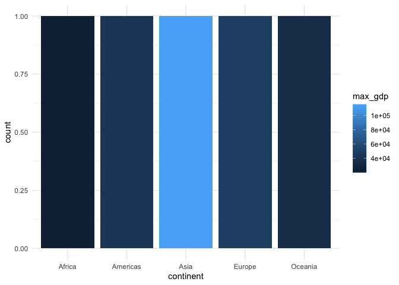

```r
knitr::opts_chunk$set(echo = TRUE)
```


# Task 1 - Low Life Expectancies within Continents over time: 


```r
gapminder
```

```
## # A tibble: 1,704 x 6
##    country     continent  year lifeExp      pop gdpPercap
##    <fct>       <fct>     <int>   <dbl>    <int>     <dbl>
##  1 Afghanistan Asia       1952    28.8  8425333      779.
##  2 Afghanistan Asia       1957    30.3  9240934      821.
##  3 Afghanistan Asia       1962    32.0 10267083      853.
##  4 Afghanistan Asia       1967    34.0 11537966      836.
##  5 Afghanistan Asia       1972    36.1 13079460      740.
##  6 Afghanistan Asia       1977    38.4 14880372      786.
##  7 Afghanistan Asia       1982    39.9 12881816      978.
##  8 Afghanistan Asia       1987    40.8 13867957      852.
##  9 Afghanistan Asia       1992    41.7 16317921      649.
## 10 Afghanistan Asia       1997    41.8 22227415      635.
## # … with 1,694 more rows
```


### Defining 'Low Life Expectancy'

#### To establish thresholds for low and high life expectancy, lets summarise life expectancies of the global population. LifeExp is related to year, therefore it may be misleading to ignore the year in obtaining these values to set our threshold. Using most recent year, for example, will yield the highest possible values. To compensate, we will examine life expactancy around the median year in the data set.


```r
median(gapminder$year)
```

```
## [1] 1979.5
```


```r
gapminder %>% 
  filter(year == "1982") %>% 
  summarise(mu = mean(lifeExp),
            sigma = sd(lifeExp)) 
```

```
## # A tibble: 1 x 2
##      mu sigma
##   <dbl> <dbl>
## 1  61.5  10.8
```


#### Average life expactancy appears to be about 61.5 years in the year 1982. Low life expectancy can be defined as any life expectancy one standard deviation below the mean, representing the lower 32% of the population. As a absolute value, this is 50.7 years.

## 1.1 - Tibble: Number of Countries with Low Life Expectancy per Continent over Time


```r
gapminder %>% 
  mutate(smallLifeExp = lifeExp < 50.7) %>% 
  group_by(continent, year) %>% 
  tally(smallLifeExp)
```

```
## # A tibble: 60 x 3
## # Groups:   continent [5]
##    continent  year     n
##    <fct>     <int> <int>
##  1 Africa     1952    50
##  2 Africa     1957    50
##  3 Africa     1962    47
##  4 Africa     1967    42
##  5 Africa     1972    37
##  6 Africa     1977    29
##  7 Africa     1982    26
##  8 Africa     1987    22
##  9 Africa     1992    22
## 10 Africa     1997    21
## # … with 50 more rows
```

## 1.2 - Plot: Number of Countries with Low Life Expectancy per Continent over Time


```r
gapminder %>% 
  mutate(smallLifeExp = lifeExp < 50.7) %>% 
  group_by(continent, year) %>% 
  tally(smallLifeExp) %>% 
  ggplot(aes(year, n, group = continent, colour = continent)) +
    geom_point() + 
    geom_line() +
    theme_minimal() +
    ylab("Number of Countries with Low Life Expectancies")
```

<!-- -->


## 1.3 - Discussion: Declining Countries with Low Life Expectancies over Time

#### Looking at the plot, we can see that the number of countries within each continent with a "low life expectancy", as defined by average life expectancies below 50.7 years, decreases over time. This cannot be said for the Oceania region, as life expectancies are above 50.7 between 1952 and 2007. All countries within Europe and the Americas have a life expectancy above 50.7 by the 1980s, Asia only missing this statistic by a few countries. Africa continues to have coutries with low life expectancies, although the number of countries has been steadily declining.

------

# Task 2 - Min & Max GDP Per Capita for each Continent: 

## 2.1 - Tibble: Each Continent's Minimum and Maximum GDP Per Capita, irrelevent of time


```r
gapminder %>% 
  group_by(continent) %>% 
  summarise(max_gdp = max(gdpPercap),
            min_gdp = min(gdpPercap))
```

```
## # A tibble: 5 x 3
##   continent max_gdp min_gdp
##   <fct>       <dbl>   <dbl>
## 1 Africa     21951.    241.
## 2 Americas   42952.   1202.
## 3 Asia      113523.    331 
## 4 Europe     49357.    974.
## 5 Oceania    34435.  10040.
```

## 2.2 - Plot: Each Continent's Minimum and Maximum GDP Per Capita, irrelevent of time

### From the way the data is organized in 2.1, it seemed quite difficult to create a tacked bar graph - either that, or I didn't know how, despite research. In order to effectively create the stacked bar graph I wanted to make, I had to pivot the data first


```r
gapminder %>% 
  group_by(continent) %>% 
  summarise(max_gdp = max(gdpPercap),
            min_gdp = min(gdpPercap)) %>% 
  pivot_longer(cols = c(max_gdp, min_gdp),
               names_to = "min_or_max",
               values_to = "GDPPerCapita") %>% 
  ggplot(aes(x = continent, y = GDPPerCapita, fill = min_or_max)) +
  geom_bar(stat = "identity") +
  theme_minimal() +
  theme(legend.title = element_blank())+
  scale_fill_discrete(labels = c("Maximum GDP Value", "Minimum GDP Value")) +
  scale_y_continuous("GDP per capita", labels = scales::dollar_format())
```

<!-- -->

### It's quite difficult to see the Min GDP values given the graph scale, so I've changed the scale into log base 10.


```r
gapminder %>% 
  group_by(continent) %>% 
  summarise(max_gdp = max(gdpPercap),
            min_gdp = min(gdpPercap)) %>% 
  pivot_longer(cols = c(max_gdp, min_gdp),
               names_to = "min_or_max",
               values_to = "GDPPerCapita") %>% 
  ggplot(aes(x = continent, y = GDPPerCapita, fill = min_or_max)) +
  geom_bar(stat = "identity") +
  theme_minimal() +
  theme(legend.title = element_blank())+
  scale_fill_discrete(labels = c("Maximum GDP Value", "Minimum GDP Value")) +
  scale_y_log10("GDP per capita", labels = scales::dollar_format())
```

<!-- -->


### Some details of this graph was rather finicky, among some common sites, I stumbled upon (Data Nova)[https://www.datanovia.com/en/], which was a helpful resource for some formatting details.


```r
gapminder %>% 
  group_by(continent) %>% 
  summarise(max_gdp = max(gdpPercap),
            min_gdp = min(gdpPercap)) %>% 
  ggplot(aes(continent, fill = max_gdp)) +
  geom_bar() +
  theme_minimal()
```

<!-- -->


## X.3 - Discussion:

------

# Task X - blah: 

## X.1 - Tibble: 

## X.2 - Plot:

## X.3 - Discussion:

------

