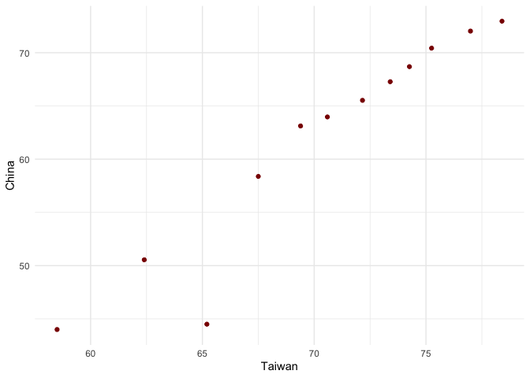

# Part 1 - Univariate Option 1: Comparing Life Expectancies over Time

Full dataframe for reference...


```r
gapminder
```

```
## # A tibble: 1,704 x 6
##    country     continent  year lifeExp      pop gdpPercap
##    <fct>       <fct>     <int>   <dbl>    <int>     <dbl>
##  1 Afghanistan Asia       1952    28.8  8425333      779.
##  2 Afghanistan Asia       1957    30.3  9240934      821.
##  3 Afghanistan Asia       1962    32.0 10267083      853.
##  4 Afghanistan Asia       1967    34.0 11537966      836.
##  5 Afghanistan Asia       1972    36.1 13079460      740.
##  6 Afghanistan Asia       1977    38.4 14880372      786.
##  7 Afghanistan Asia       1982    39.9 12881816      978.
##  8 Afghanistan Asia       1987    40.8 13867957      852.
##  9 Afghanistan Asia       1992    41.7 16317921      649.
## 10 Afghanistan Asia       1997    41.8 22227415      635.
## # … with 1,694 more rows
```

## 1.1: Pivoting Wider to Comapre two Countries


```r
gapminder %>% 
  filter(country == "China" | country == "Taiwan") %>% #isolating counries of interest
  select(country, year, lifeExp) %>% #isolating variables of interest
  pivot_wider(id_cols = year, #pivot, keeping year column
              names_from = country, #pulling new columns from country column
              values_from = lifeExp) #pulling values from lifeExp column
```

```
## # A tibble: 12 x 3
##     year China Taiwan
##    <int> <dbl>  <dbl>
##  1  1952  44     58.5
##  2  1957  50.5   62.4
##  3  1962  44.5   65.2
##  4  1967  58.4   67.5
##  5  1972  63.1   69.4
##  6  1977  64.0   70.6
##  7  1982  65.5   72.2
##  8  1987  67.3   73.4
##  9  1992  68.7   74.3
## 10  1997  70.4   75.2
## 11  2002  72.0   77.0
## 12  2007  73.0   78.4
```

## 1.2: Plotting with the New Data Layout


```r
gapminder %>% 
  filter(country == "China" | country == "Taiwan") %>% 
  select(country, year, lifeExp) %>% 
  pivot_wider(id_cols = year,
              names_from = country,
              values_from = lifeExp) %>% 
  ggplot(aes(Taiwan, China)) + #plotting Taiwan against China
  geom_point(colour = "dark red") + #using point geom with dark red colour
  theme_minimal()
```

<!-- -->

## 1.3: Pivoting Longer to Return Original Organization
 

```r
gapminder %>% 
  filter(country == "China" | country == "Taiwan") %>% 
  select(country, year, lifeExp) %>% 
  pivot_wider(id_cols = year,
              names_from = country,
              values_from = lifeExp) %>% 
  pivot_longer(cols = c(China, Taiwan), #compressing our country columns
               names_to = "country", #creating new country column for the two countries
               values_to = "lifeExp") #directing values to new lifeExp column
```

```
## # A tibble: 24 x 3
##     year country lifeExp
##    <int> <chr>     <dbl>
##  1  1952 China      44  
##  2  1952 Taiwan     58.5
##  3  1957 China      50.5
##  4  1957 Taiwan     62.4
##  5  1962 China      44.5
##  6  1962 Taiwan     65.2
##  7  1967 China      58.4
##  8  1967 Taiwan     67.5
##  9  1972 China      63.1
## 10  1972 Taiwan     69.4
## # … with 14 more rows
```

# Part 2 - Multivariate Option 1: Life Expectancy and GDP per Capita over Time

## 2.1: Pivoting Data to the New Layout


```r
gapminder %>% 
  filter(country == "China" | country == "Taiwan") %>% 
  select(country, year, lifeExp, gdpPercap) %>% 
  pivot_wider(id_cols = year, #keeping year column
              names_from = country, #pulling values from country column for new columns
              names_sep = "--", #choosing separation the column components
              values_from = c(lifeExp, gdpPercap)) #pulling values from our measures for new columns
```

```
## # A tibble: 12 x 5
##     year `lifeExp--China` `lifeExp--Taiwa… `gdpPercap--Chi…
##    <int>            <dbl>            <dbl>            <dbl>
##  1  1952             44               58.5             400.
##  2  1957             50.5             62.4             576.
##  3  1962             44.5             65.2             488.
##  4  1967             58.4             67.5             613.
##  5  1972             63.1             69.4             677.
##  6  1977             64.0             70.6             741.
##  7  1982             65.5             72.2             962.
##  8  1987             67.3             73.4            1379.
##  9  1992             68.7             74.3            1656.
## 10  1997             70.4             75.2            2289.
## 11  2002             72.0             77.0            3119.
## 12  2007             73.0             78.4            4959.
## # … with 1 more variable: `gdpPercap--Taiwan` <dbl>
```

## 2.2: Pivoting Data Back to Original Format


```r
gapminder %>% 
  filter(country == "China" | country == "Taiwan") %>% 
  select(country, year, lifeExp, gdpPercap) %>% 
  pivot_wider(id_cols = year,
              names_from = country,
              names_sep = "--",
              values_from = c(lifeExp, gdpPercap)) %>% 
  pivot_longer(cols = -year, #selecting all columns except year to compress
               names_sep = "--", #identifying what separates the components embedded in the columns
               names_to = c(".value", "country")) #directing new columns and their content
```

```
## # A tibble: 24 x 4
##     year country lifeExp gdpPercap
##    <int> <chr>     <dbl>     <dbl>
##  1  1952 China      44        400.
##  2  1952 Taiwan     58.5     1207.
##  3  1957 China      50.5      576.
##  4  1957 Taiwan     62.4     1508.
##  5  1962 China      44.5      488.
##  6  1962 Taiwan     65.2     1823.
##  7  1967 China      58.4      613.
##  8  1967 Taiwan     67.5     2644.
##  9  1972 China      63.1      677.
## 10  1972 Taiwan     69.4     4063.
## # … with 14 more rows
```

Note to self: the order arguments are entered into names_to is important - reversing the order gives funky results. I'm guessing this is due to "lifeExp" and "gdpPercap" (which are the values I'm retaining into columns) being the first component in the column header, and the countries being the second component.

# Part 3 - Table Joins


```r
guest <- read_csv("https://raw.githubusercontent.com/STAT545-UBC/Classroom/master/data/wedding/attend.csv")
```

```
## Parsed with column specification:
## cols(
##   party = col_double(),
##   name = col_character(),
##   meal_wedding = col_character(),
##   meal_brunch = col_character(),
##   attendance_wedding = col_character(),
##   attendance_brunch = col_character(),
##   attendance_golf = col_character()
## )
```

```r
email <- read_csv("https://raw.githubusercontent.com/STAT545-UBC/Classroom/master/data/wedding/emails.csv")
```

```
## Parsed with column specification:
## cols(
##   guest = col_character(),
##   email = col_character()
## )
```


## 3.1 - Adding Email Addresses to the Guestlist

First, lets exmamine our data files to help with visualizing the code.


```r
guest
```

```
## # A tibble: 30 x 7
##    party name  meal_wedding meal_brunch attendance_wedd… attendance_brun…
##    <dbl> <chr> <chr>        <chr>       <chr>            <chr>           
##  1     1 Somm… PENDING      PENDING     PENDING          PENDING         
##  2     1 Phil… vegetarian   Menu C      CONFIRMED        CONFIRMED       
##  3     1 Blan… chicken      Menu A      CONFIRMED        CONFIRMED       
##  4     1 Emaa… PENDING      PENDING     PENDING          PENDING         
##  5     2 Blai… chicken      Menu C      CONFIRMED        CONFIRMED       
##  6     2 Nige… <NA>         <NA>        CANCELLED        CANCELLED       
##  7     3 Sine… PENDING      PENDING     PENDING          PENDING         
##  8     4 Ayra… vegetarian   Menu B      PENDING          PENDING         
##  9     5 Atla… PENDING      PENDING     PENDING          PENDING         
## 10     5 Denz… fish         Menu B      CONFIRMED        CONFIRMED       
## # … with 20 more rows, and 1 more variable: attendance_golf <chr>
```

```r
email
```

```
## # A tibble: 14 x 2
##    guest                                             email                 
##    <chr>                                             <chr>                 
##  1 Sommer Medrano, Phillip Medrano, Blanka Medrano,… sommm@gmail.com       
##  2 Blair Park, Nigel Webb                            bpark@gmail.com       
##  3 Sinead English                                    singlish@hotmail.ca   
##  4 Ayra Marks                                        marksa42@gmail.com    
##  5 Jolene Welsh, Hayley Booker                       jw1987@hotmail.com    
##  6 Amayah Sanford, Erika Foley                       erikaaaaaa@gmail.com  
##  7 Ciaron Acosta                                     shining_ciaron@gmail.…
##  8 Diana Stuart                                      doodledianastu@gmail.…
##  9 Daisy-May Caldwell, Martin Caldwell, Violet Cald… caldwellfamily5212@gm…
## 10 Rosanna Bird, Kurtis Frost                        rosy1987b@gmail.com   
## 11 Huma Stokes, Samuel Rutledge                      humastokes@gmail.com  
## 12 Eddison Collier, Stewart Nicholls                 eddison.collier@gmail…
## 13 Turner Jones                                      tjjones12@hotmail.ca  
## 14 Albert Marshall, Vivian Marshall                  themarshallfamily1234…
```


```r
email_longer <- email %>% 
  separate_rows(guest, sep = ", ") #convert the email list from groups of guests to individual guests
guest %>% 
  left_join(email_longer, c("name" = "guest")) #join into the guest table using guest/name as common reference
```

```
## # A tibble: 30 x 8
##    party name  meal_wedding meal_brunch attendance_wedd… attendance_brun…
##    <dbl> <chr> <chr>        <chr>       <chr>            <chr>           
##  1     1 Somm… PENDING      PENDING     PENDING          PENDING         
##  2     1 Phil… vegetarian   Menu C      CONFIRMED        CONFIRMED       
##  3     1 Blan… chicken      Menu A      CONFIRMED        CONFIRMED       
##  4     1 Emaa… PENDING      PENDING     PENDING          PENDING         
##  5     2 Blai… chicken      Menu C      CONFIRMED        CONFIRMED       
##  6     2 Nige… <NA>         <NA>        CANCELLED        CANCELLED       
##  7     3 Sine… PENDING      PENDING     PENDING          PENDING         
##  8     4 Ayra… vegetarian   Menu B      PENDING          PENDING         
##  9     5 Atla… PENDING      PENDING     PENDING          PENDING         
## 10     5 Denz… fish         Menu B      CONFIRMED        CONFIRMED       
## # … with 20 more rows, and 2 more variables: attendance_golf <chr>,
## #   email <chr>
```

I had some trouble getting the join to reconcile groups of parties in the email list and the lis of names in the guest list. To fix this, I first re-arranged the email list into individual names and joined the names column with the new, longer, guests column.

## 3.2 - Identifying Non-Guestlist Emails


```r
email_longer %>% 
  anti_join(guest, c("guest" = "name")) #removing shared rows between guest/name column from email table
```

```
## # A tibble: 3 x 2
##   guest           email                          
##   <chr>           <chr>                          
## 1 Turner Jones    tjjones12@hotmail.ca           
## 2 Albert Marshall themarshallfamily1234@gmail.com
## 3 Vivian Marshall themarshallfamily1234@gmail.com
```

## 3.3 - Making a Full Guestlist and Email List


```r
guest %>% 
  full_join(email_longer, c("name" = "guest")) #completely joining tables using name/guest columns as reference
```

```
## # A tibble: 33 x 8
##    party name  meal_wedding meal_brunch attendance_wedd… attendance_brun…
##    <dbl> <chr> <chr>        <chr>       <chr>            <chr>           
##  1     1 Somm… PENDING      PENDING     PENDING          PENDING         
##  2     1 Phil… vegetarian   Menu C      CONFIRMED        CONFIRMED       
##  3     1 Blan… chicken      Menu A      CONFIRMED        CONFIRMED       
##  4     1 Emaa… PENDING      PENDING     PENDING          PENDING         
##  5     2 Blai… chicken      Menu C      CONFIRMED        CONFIRMED       
##  6     2 Nige… <NA>         <NA>        CANCELLED        CANCELLED       
##  7     3 Sine… PENDING      PENDING     PENDING          PENDING         
##  8     4 Ayra… vegetarian   Menu B      PENDING          PENDING         
##  9     5 Atla… PENDING      PENDING     PENDING          PENDING         
## 10     5 Denz… fish         Menu B      CONFIRMED        CONFIRMED       
## # … with 23 more rows, and 2 more variables: attendance_golf <chr>,
## #   email <chr>
```


