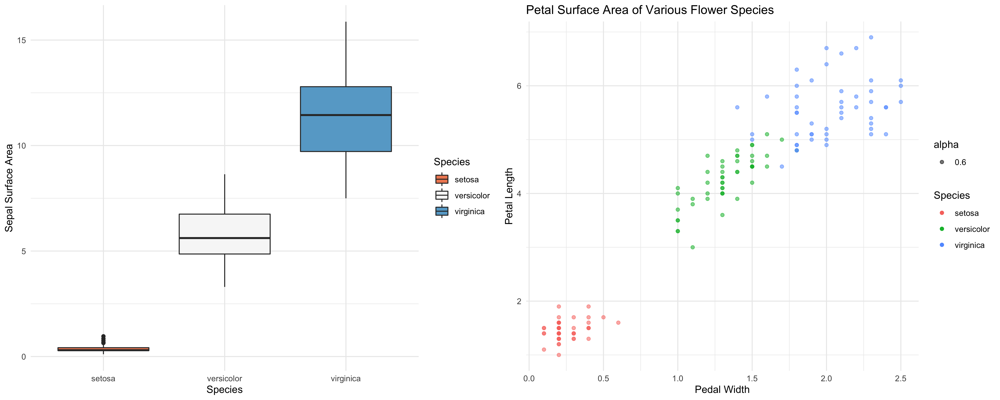

```{r setup, include=FALSE}
knitr::opts_chunk$set(echo = TRUE)
```

```{r, warning = FALSE, echo = FALSE}
suppressPackageStartupMessages(library(dplyr))
suppressPackageStartupMessages(library(tidyverse))
suppressPackageStartupMessages(library(gapminder))
suppressPackageStartupMessages(library(scales))
suppressPackageStartupMessages(library(DT))
suppressPackageStartupMessages(library(forcats))
suppressPackageStartupMessages(library(here))
suppressPackageStartupMessages(library(kableExtra))
suppressPackageStartupMessages(library(gridExtra))
```

# Exercise 1: The Value of 'here' Package - Superior File and Path Management

Broadly speaking, using the 'here' package is a more robust way of managing your and directories, paths, and files compared to conventional, manual management. Conventional set-ups like rm(list = ls()) doesn't truly clean your R session while setwd() lends itself to file paths designed exclusively for your computer and directory but not necessarily others. We can tackle some of these issues by setting up projects, but we still maximize functionality by using projects in tandem with the 'here' package. 'here' essentially does the dirty work of detecting root directories and using this information to navigate paths in a way that is neutral to your platform. Indeed, 'here' can operate seamlessly between operating systems like Mac and Windows, which have slightly different labelling systems for directory pathways. There is no need for another user to re-write code in order for the script to navigate their directory or their operating system. Further, if a project has sub-directories, 'here' is not restricted by a local working directory; it can use the project directory to seamlessly pull files from other locations or save files to different locations. If paths in the directory change, 'here' will still function correctly with no code changes required. 'here' will also allow files to run outside of their Rstudio project. Ultimately, a staple of data-driven science is reproducibility, and the 'here' package offers more seamless, reproducible workflow for ventures both within and between individuals.

# Exercise 2: Factor Management

Let's first take a look at our full gapminder data set for context in this exercise

```{r}
datatable(gapminder)
```

Now Let's Examine what categorical variables in our dataframe are factors

```{r}
class(gapminder$country)
class(gapminder$continent)
```

Therefore, both Country and Continent are factors. 

## Dropping Oceania

Before dropping Oceania, let's check how many oberervations we have so we can later verify their removal. This removal will happen in a new gapminder dataframe, so we'll make that now too and work with this new dataframe

```{r}
new_gapminder <- gapminder
levels(new_gapminder$continent)
nlevels(new_gapminder$continent)
```

Lit fam, we have 5 continents. Let's drop Oceania.

```{r}
keep_continents <- c("Americas", "Africa", "Asia", "Europe")

target_factors <- new_gapminder %>% 
  filter(continent %in% keep_continents)

dropped_gapminder <- target_factors %>% 
  droplevels()

levels(dropped_gapminder$continent)
nlevels(dropped_gapminder$continent)
```

## Re-ordering by Factors: Continental Min GDP

Let's organize our factors - in this case continent - by something other than the alphabet. How about minimum GDP per capita? First we'll find the min GDP, and then we'll do some sorting.

```{r}
gapminder %>% 
  select(continent, gdpPercap) %>%
  group_by(continent) %>%
  summarise(minGDP = min(gdpPercap)) %>%
  ggplot() +
  geom_col(aes(fct_reorder(continent, minGDP, max), minGDP, fill = continent)) +
  xlab("Continent") +
  ggtitle("Continental Minimum GDP per capita") +
  scale_y_continuous("GDP per capita", labels = scales::dollar_format()) +
  theme_minimal() +
  scale_fill_brewer() +
  theme(legend.position = "none")
```

# Exercise 3: File Input / Output

To reduce the size of the data we're working with, I chose to use Life Expectancy. I was born in 1997 in North America, so let's examine Life Expectancies in the Americas is the year 1997. First we'll filter the data set, then we'll write this into its own .csv file, then read this dataframe, and finally generate two plots: one from the original gapminder dataframe and one from the new dataframe, in order to evaluate the input/output process.

```{r}
(gapminder_Amer <- gapminder %>% 
   filter(continent == "Americas", year == "1997") %>%
   select(country, lifeExp) %>%
   group_by(country))

datatable(gapminder_Amer)

write_csv(gapminder_Amer, here::here("Hw05", "lifeExpAmer.csv"))
(lifeExpAmer <- read_csv(here::here("Hw05", "lifeExpAmer.csv")))

lifeExpAmer %>%
  ggplot() +
  geom_col(aes(fct_reorder(country, lifeExp, max), lifeExp)) +
  scale_y_continuous("Life Expectancy") +
  coord_flip() +
  xlab("Country") +
  ggtitle("Life Expectancy of North and South American Countries in 1997 ") +
  theme_minimal()

compare_gapminder <- gapminder %>% 
  filter(continent == "Americas", year == "1997")
  
compare_gapminder %>% 
  ggplot() +
  geom_col(aes(fct_reorder(country, lifeExp, max), lifeExp)) +
  scale_y_continuous("Life Expectancy") +
  coord_flip() +
  xlab("Country") +
  ggtitle("Life Expectancy of North and South American Countries in 1997") +
  theme_minimal()
```

The table shows us the filtered data we're working with. The first plot shows the filtered dataframe after it's been written and then read. The second shows us what that same dataframe looks like after filtering from the original dataset without any writing/reading. We can see that both plots are identical, which is a good indication the writing/reading process was successful.

# Exercise 4: Visualization Design

In my Assingment 2, I was exploring the iris dataset and looking at a crude measure of flower component surface area by calculating length x width. I compared three species of flower petal surface areas using a box plot. I think the design of this plot could be re-deigned to better show the raw data. Check out the original figure below, along with the alternate version...

```{r}
library(datasets)

fig1 <- iris %>%
  ggplot() +aes(Species, iris$Petal.Width*iris$Petal.Length, fill = Species) + geom_boxplot() + ylab("Sepal Surface Area")+ scale_fill_brewer(palette="RdBu") + theme_minimal()

fig2 <- iris %>%
  ggplot() +
  geom_point (aes(alpha = .6, Petal.Width, Petal.Length, color = Species)) +
  xlab("Pedal Width") +
  ylab("Petal Length") +
  theme_minimal() +
  ggtitle("Petal Surface Area of Various Flower Species")

saved_figure <- grid.arrange(fig1, fig2, nrow = 1, ncol = 2, widths = c(1/2, 1/2))
```

As you can see in the left figure, the boxplot hides the data points. Further, due to the small petal size of the Setosa plant, it's squished and difficult to interpret values for this species. One solution could be to add geom_point and jitter the points. Alternatively, I realize that surface area is a function of length and width, which can be plotted literally against eachother instead of calculating surface area. Plotted as a geom_point plot, this acts as a sort of jittering of points, so all data points can be seen. A reduced alpha transparency helps here as well. You can still clearly see which plants have the largest surface area petals (i.e. the top right corner), but get to see the raw data and better understand the nature of these conclusions. For example, 2 species that have similar surface areas yet relativley long or relatively wide petals will be found collected at the top or right sides of the plot, respectively. My only concern with this new graph is the ability to compare surface areas directly against two species - in the example just given, two surface areas may be the same but derived from different legnth x width dimensions, and this could be difficult to see. However, for this dataset, this is not an issue as all species have clearly different surface areas. I also thought the surface area component of the whole data may not be a intuitive, as the axis combination is not entirely conventional, but this can partially be mitigated via the title, which is clear in stating surface area is the main take-away. Notably, no specifics on the unit of measure if provided in the data, so I can't add that to the axis labels. Overall, I thought this alternate visualization is a little more compelling and gives a good visual of the raw data.

Also, I can't seem to get these two figures un-squished! the grid.arrange work well to get them side-by-side, but I'm still working on getting them to have appropriate widths. In sasving the figure and reading it again as a .png, it seems to look better.


# Exercise 5: Writing Figures to Files

Here we will save the previouss figure as a .png file, and then read this new file back into our script.

```{r}
ggsave("saved_figure.png", saved_figure, width = 15, height = 6, dpi = 320)
```




